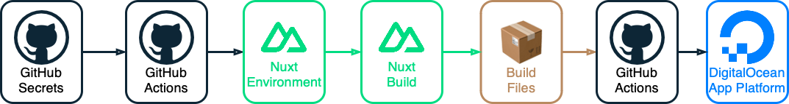

# The People's Country Website

_The People's Country_ Website was created using [Nuxt 3](https://nuxt.com), for more information on building with Nuxt 3, look at the [Nuxt 3 Documentation](https://nuxt.com/docs/getting-started/introduction).

### Secret Management

Secrets are stored in [`"Settings" > "Secrets and variables" > "Actions"`](https://github.com/the-peoples-country/the-peoples-country.github.io/settings/secrets/actions)

#### Secrets Management Flow

